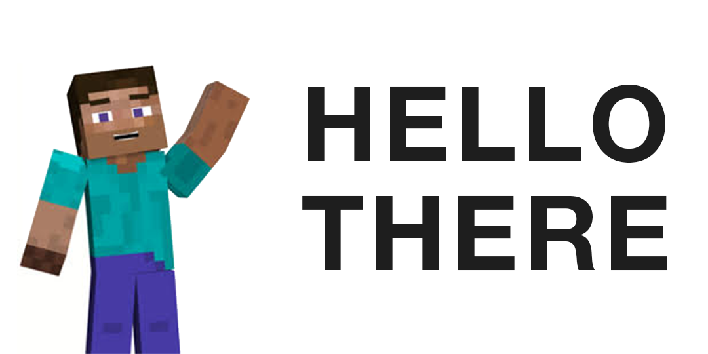

### <h1 align="center">HELLO THERE, WANDERING TRAVELER! 👋 </h1>

### <h1 align="center">ABOUT ME ✒</h1>

  

    Hi! My name is <strong>Abhinn Krishn</strong>.
     
    <strong>Gender:</strong> Male/He/Him.
     
    <strong>Age:</strong> 19
     
    <strong>Country:</strong> India 🇮🇳
     
    <strong>Occupation:</strong> Sophomore Engg. Student
    

    

      
    

<!--

-->
<!--
**pikachuonacid/pikachuonacid** is a ✨ _special_ ✨ repository because its `README.md` (this file) appears on your GitHub profile.

Here are some ideas to get you started:

- 🔭 I’m currently working on ...
- 🌱 I’m currently learning ...
- 👯 I’m looking to collaborate on ...
- 🤔 I’m looking for help with ...
- 💬 Ask me about ...
- 📫 How to reach me: ...
- 😄 Pronouns: ...
- ⚡ Fun fact: ...
-->
